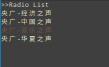

# linux 下的网络收音机

使用 vlc 播放电台，电台流存放在 radio_list 文件里面，如果要添加其它的电台的话可以去电台的官网抓他们的串出来，比如央广的串的前缀一般都是 http://live.xmcdn.com/live/ ，也可以去各大主流电台网站像蜻蜓等抓他们的串来播放

## 使用

python3 \_\_init\_\_.py
因为是才学 python，在打包安装到本地环境的时候一直提示找不到模块，搞了两天没找到原因，所以现在只能通过直接跑脚本的方式使用

## 快捷键

- j: 下
- k: 上
- l: 播放
- s: 停止
- q: 退出

## 简单界面

